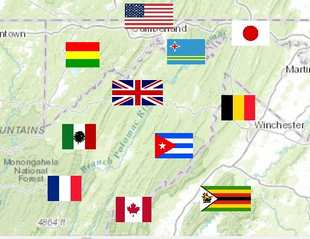

# Country Flag Icons

Icons for country flags provided in various formats.

### Features

Country flag icons provided in formats:

* SVG
* PNG
* EMF
* ArcGIS Style (10.X, Pro 1.2)

A table to convert between the various Country Code/Name formats (ISO 3166-2, STANAG 1059, GENC): 
[CountryCodes-ISO-STANAG-GENC.csv](./CountryCodes-ISO-STANAG-GENC.csv)

### Credits / Attribution 

SVG Files were obtained from: https://github.com/stevenrskelton/flag-icon

Attributed to: https://github.com/koppi 

These are provided under the MIT License: https://opensource.org/licenses/MIT 

### License

Any additional/original work in this repository is also provided under the [MIT License](./LICENSE.txt)
