|Country Name (ISO 3166-2)|2 Letter (ISO 3166-2)|Country Name (STANAG 1059 )|2 Letter (STANAG 1059)|3 Letter (STANAG 1059)|Country Name (GENC)|3 Letter (GENC)|Flag|
|---|---|---|---|---|---|---|---|
|Andorra|AD|Andorra|AN|AND|Andorra|AND||
|United Arab Emirates      |AE|United Arab Emirates|TC|ARE|United Arab Emirates|ARE||
|Afghanistan      |AF|Afghanistan|AF|AFG|Afghanistan|AFG||
|Antigua and Barbuda   |AG|Antigua and Barbuda|AC|ATG|Antigua and Barbuda|ATG||
|Anguilla      |AI|Anguilla|AV|AIA|Anguilla|AIA||
|Albania        |AL|Albania|AL|ALB|Albania|ALB||
|Armenia       |AM|Armenia|AM|ARM|Armenia|ARM||
|Angola    |AO|Angola|AO|AGO|Angola|AGO||
|Antarctica        |AQ|Antarctica|AY|ATA|Antarctica|ATA||
|Argentina        |AR|Argentina|AR|ARG|Argentina|ARG||
|American Samoa        |AS|American Samoa|SS|ASM|American Samoa|ASM||
|Austria     |AT|Austria|AU|AUT|Austria|AUT||
|Australia      |AU|Australia|AS|AUS|Australia|AUS||
|Aruba|AW|Aruba|AA|ABW|Aruba|ABW||
|Azerbaijan    |AZ|Azerbaijan|AJ|AZE|Azerbaijan|AZE||
|Bosnia and Herzegovina|BA|Bosnia-Herzegovina|BK|BIH|Bosnia and Herzegovina|BIH||
|Barbados|BB|Barbados|BB|BRB|Barbados|BRB||
|Bangladesh    |BD|Bangladesh|BG|BGD|Bangladesh|BGD||
|Belgium|BE|Belgium|BE|BEL|Belgium|BEL||
|Burkina Faso|BF|Burkina Faso|UV|BFA|Burkina Faso|BFA||
|Bulgaria   |BG|Bulgaria|BU|BGR|Bulgaria|BGR||
|Bahrain      |BH|Bahrain|BA|BHR|Bahrain|BHR|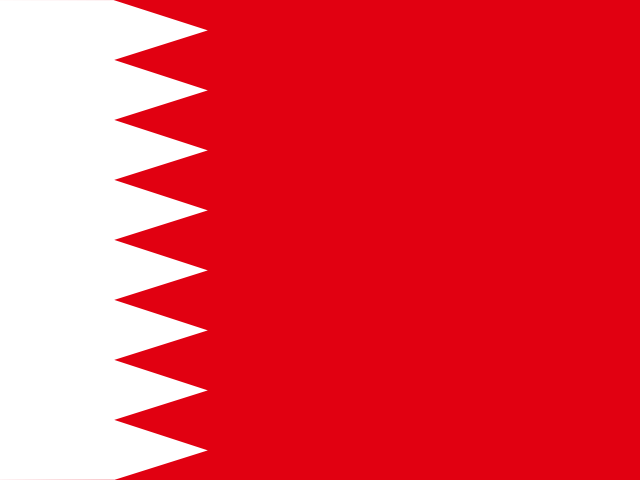|
|Burundi|BI|Burundi|BY|BDI|Burundi|BDI||
|Benin|BJ|Benin|BN|BEN|Benin|BEN||
|Bermuda|BM|Bermuda|BD|BMU|Bermuda|BMU||
|Brunei Darussalam|BN|Brunei|BX|BRN|Brunei|BRN||
|Bolivia, Plurinational State of|BO|Bolivia|BL|BOL|Bolivia|BOL||
|Brazil|BR|Brazil|BR|BRA|Brazil|BRA||
|Bahamas|BS|The Bahamas|BF|BHS|Bahamas, The|BHS|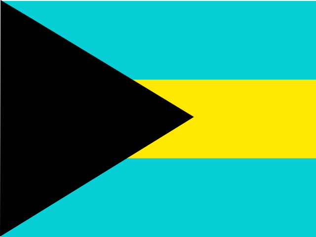|
|Bhutan|BT|Bhutan|BT|BTN|Bhutan|BTN||
|Bouvet Island|BV|Bouvet Island|BV|BVT|Bouvet Island|BVT|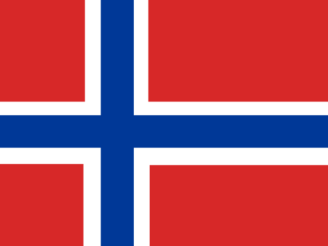|
|Botswana|BW|Botswana|BC|BWA|Botswana|BWA||
|Belarus|BY|Belarus|BO|BLR|Belarus|BLR||
|Belize|BZ|Belize|BH|BLZ|Belize|BLZ||
|Canada|CA|Canada|CA|CAN|Canada|CAN||
|Cocos (Keeling) Islands|CC|Cocos (Keeling) Islands|CK|CCK|Cocos (Keeling) Islands|CCK|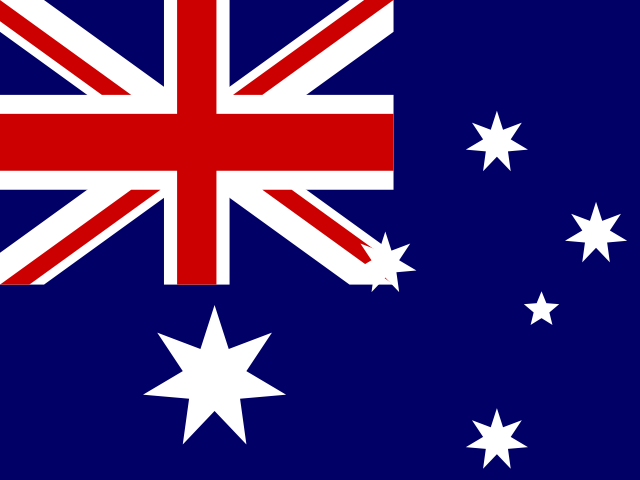|
|Congo, the Democratic Republic of the|CD|Democratic Republic of the Congo|CD|COD|Congo (Kinshasa)|COD||
|Central African Republic|CF|Central African Republic|CT|CAF|Central African Republic|CAF||
|Congo|CG|Republic of the Congo|CF|COG|Congo (Brazzaville)|COG||
|Switzerland|CH|Switzerland|SZ|CHE|Switzerland|CHE||
|CÙte d'Ivoire|CI|CÙte d'Ivoire|IV|CIV|CÙte d'Ivoire|CIV|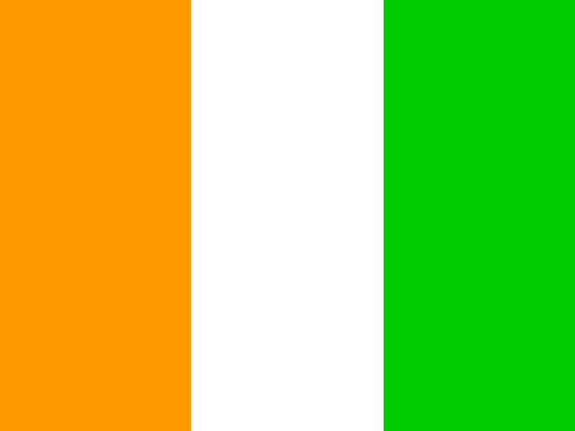|
|Cook Islands|CK|Cook Islands|CW|COK|Cook Islands|COK|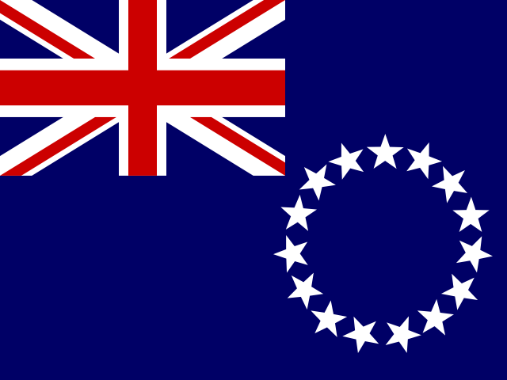|
|Chile|CL|Chile|CI|CHL|Chile|CHL|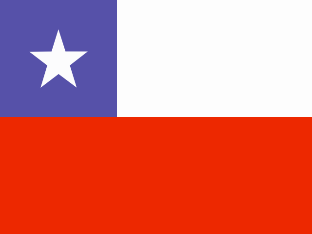|
|Cameroon|CM|Cameroun|CM|CMR|Cameroon|CMR|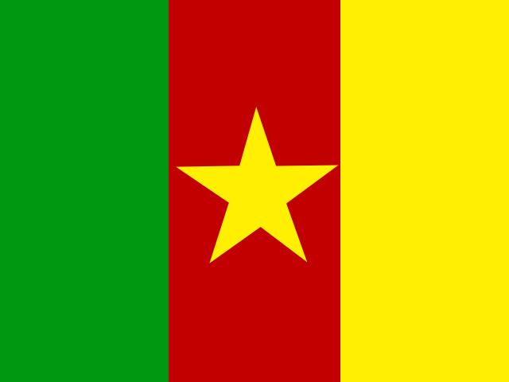|
|China|CN|People's Republic of China|CH|CHN|China|CHN|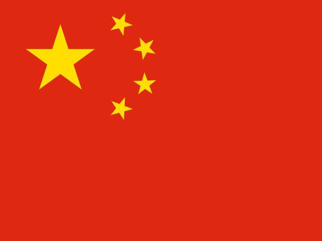|
|Colombia|CO|Colombia|CO|COL|Colombia|COL||
|Costa Rica|CR|Costa Rica|CS|CRI|Costa Rica|CRI|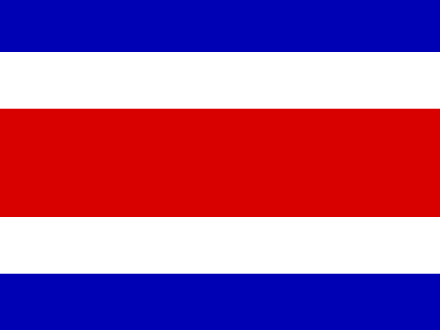|
|Cuba|CU|Cuba|CU|CUB|Cuba|CUB|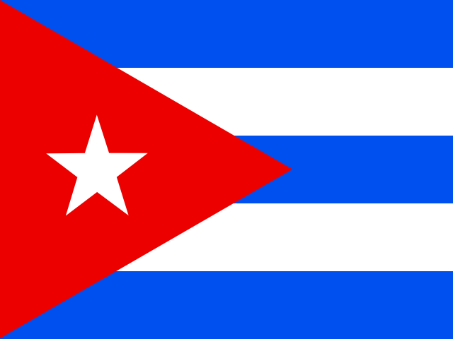|
|Cabo Verde|CV|Cape Verde|CV|CPV|Cabo Verde|CPV||
|Christmas Island|CX|Christmas Island|KT|CXR|Christmas Island|CXR|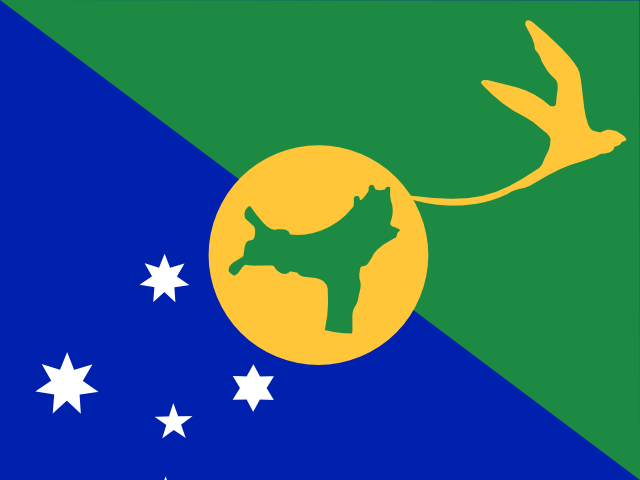|
|Cyprus|CY|Cyprus|CY|CYP|Cyprus|CYP|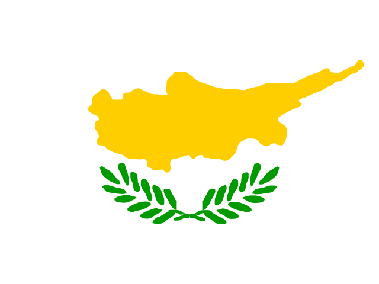|
|Czech Republic|CZ|Czech Republic|CZ|CZE|Czech Republic|CZE||
|Germany|DE|Germany|GE|DEU|Germany|DEU||
|Djibouti|DJ|Djibouti|DJ|DJI|Djibouti|DJI|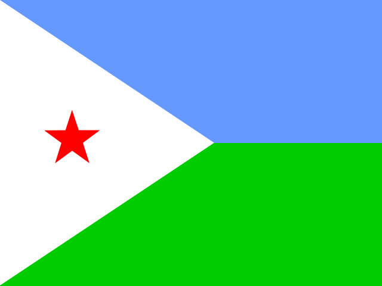|
|Denmark|DK|Denmark|DA|DNK|Denmark|DNK||
|Dominica|DM|Dominica|DO|DMA|Dominica|DMA|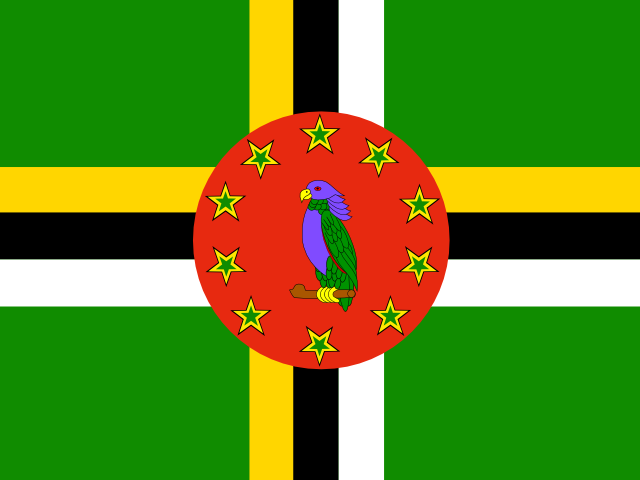|
|Dominican Republic|DO|Dominican Republic|DR|DOM|Dominican Republic|DOM|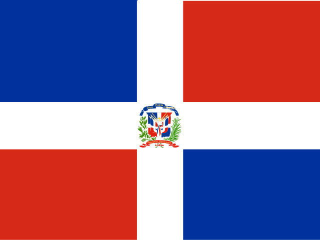|
|Algeria|DZ|Algeria|AG|DZA|Algeria|DZA||
|Ecuador|EC|Ecuador|EC|ECU|Ecuador|ECU||
|Estonia|EE|Estonia|EN|EST|Estonia|EST||
|Egypt|EG|Egypt|EG|EGY|Egypt|EGY||
|Western Sahara|EH|Western Sahara|WI|ESH|Western Sahara|ESH|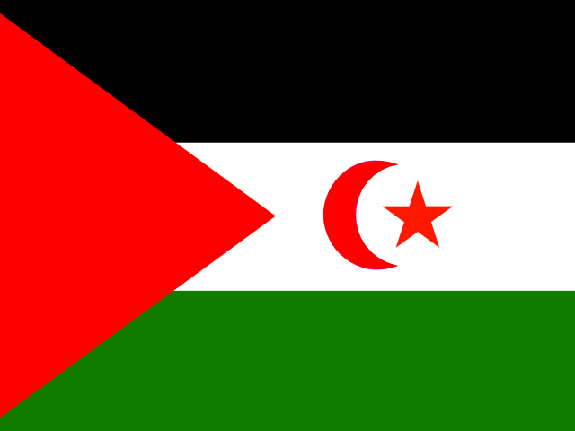|
|Eritrea|ER|Eritrea|ER|ERI|Eritrea|ERI||
|Spain|ES|Spain|ES|ESP|Spain|ESP||
|Ethiopia|ET|Ethiopia|ET|ETH|Ethiopia|ETH||
|Finland|FI|Finland|FI|FIN|Finland|FIN||
|Fiji|FJ|Fiji|FJ|FJI|Fiji|FJI||
|Falkland Islands|FK|Falkland Islands|FK|FLK|Falkland Islands (Islas Malvinas)|FLK|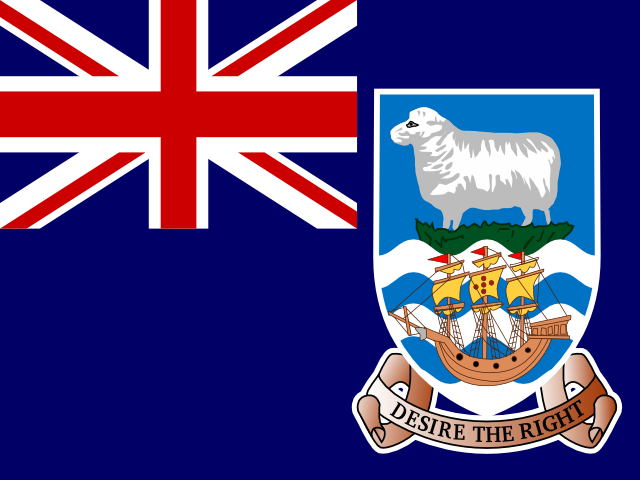|
|Micronesia, Federated States of|FM|Federated States of Micronesia|FM|FSM|Micronesia, Federated States Of|FSM||
|Faroe Islands|FO|Faroe Islands|FO|FRO|Faroe Islands|FRO|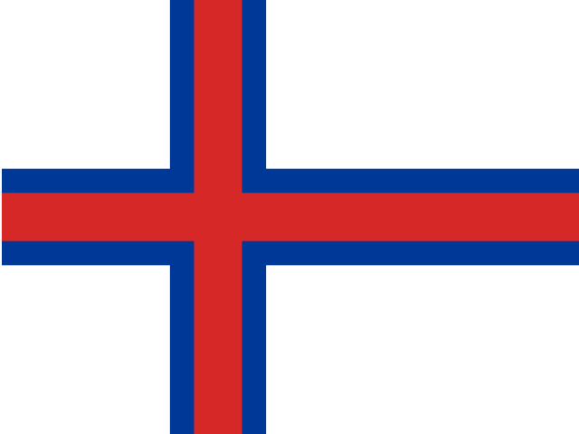|
|France|FR|France|FR|FRA|France|FRA||
|Gabon|GA|Gabon|GB|GAB|Gabon|GAB|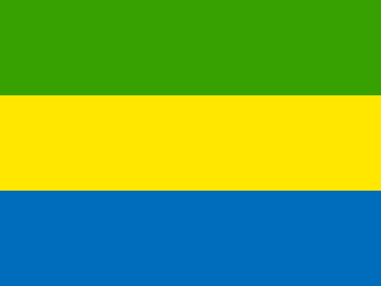|
|United Kingdom|GB|United Kingdom (Great Britain and Northern Ireland)|UK|GBR|United Kingdom|GBR||
|Grenada|GD|Grenada|GJ|GRD|Grenada|GRD|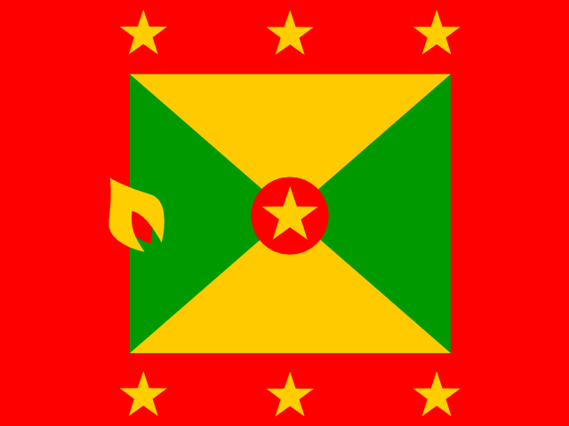|
|Georgia|GE|Georgia|GG|GEO|Georgia|GEO||
|French Guiana|GF|French Guiana|FG|GUF|French Guiana|GUF|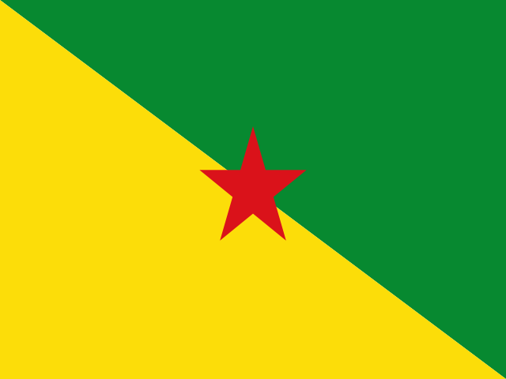|
|Ghana|GH|Ghana|GH|GHA|Ghana|GHA||
|Gibraltar|GI|Gibraltar|GI|GIB|Gibraltar|GIB|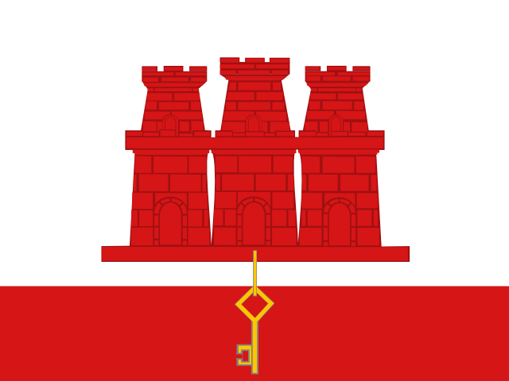|
|Greenland|GL|Greenland|GL|GRL|Greenland|GRL|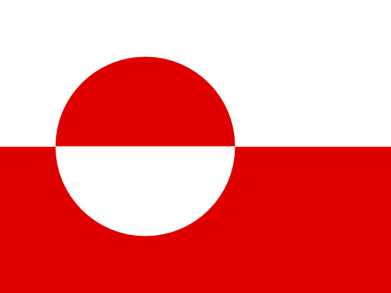|
|Gambia|GM|The Gambia|GA|GMB|Gambia, The|GMB|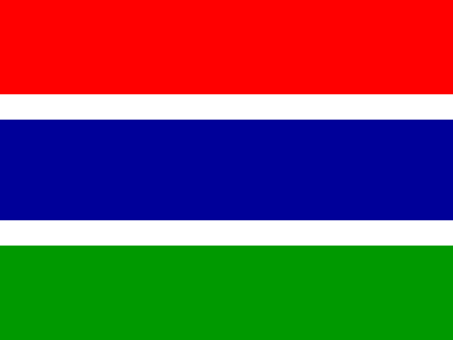|
|Guinea|GN|Guinea|GV|GIN|Guinea|GIN||
|Guadeloupe|GP|Guadeloupe|GP|GLP|Guadeloupe|GLP|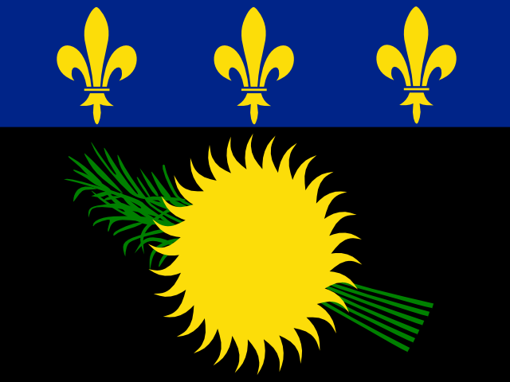|
|Equatorial Guinea|GQ|Equatorial Guinea|EK|GNQ|Equatorial Guinea|GNQ|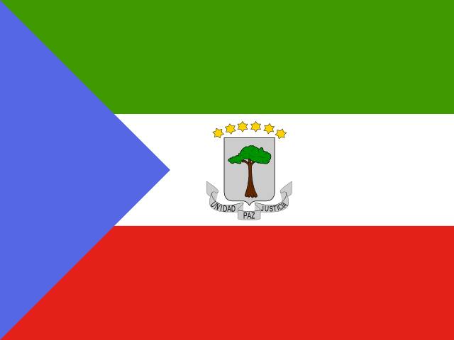|
|Greece|GR|Greece|GR|GRC|Greece|GRC||
|South Georgia and the South Sandwich Islands|GS|South Georgia and South Sandwich Islands|SX|SGS|South Georgia and South Sandwich Islands|SGS||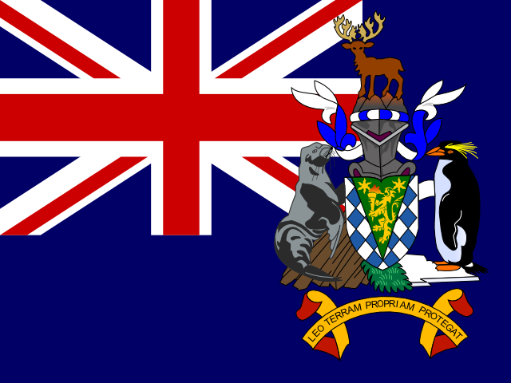|
|Guatemala|GT|Guatemala|GT|GTM|Guatemala|GTM|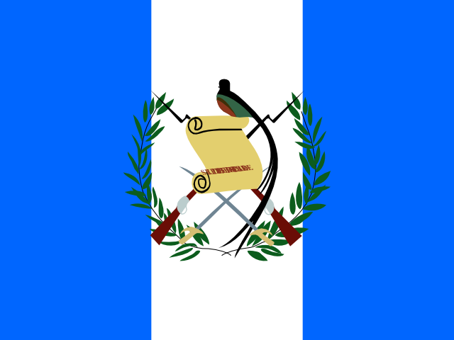|
|Guam|GU|Guam|GQ|GUM|Guam|GUM||
|Guinea-Bissau|GW|Guinea-Bissau|PU|GNB|Guinea-Bissau|GNB|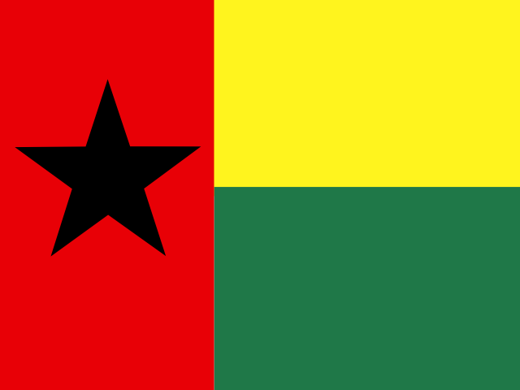|
|Guyana|GY|Guyana|GY|GUY|Guyana|GUY||
|Hong Kong|HK|Hong Kong|HK|HKG|Hong Kong|HKG||
|Heard Island and McDonald Islands|HM|Heard and McDonald Islands|HM|HMD|Heard Island and Mcdonald Islands|HMD|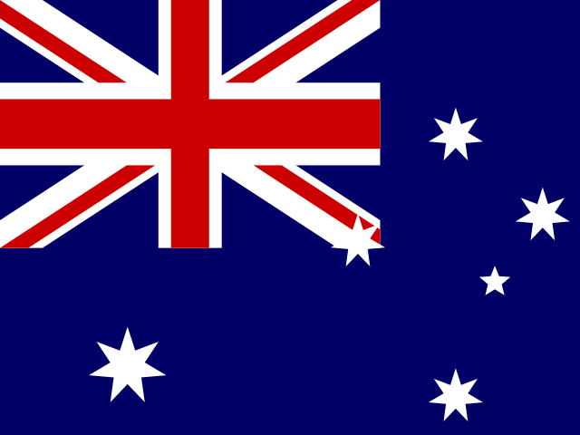|
|Honduras|HN|Honduras|HO|HND|Honduras|HND||
|Croatia|HR|Croatia|HR|HRV|Croatia|HRV||
|Haiti|HT|Haiti|HA|HTI|Haiti|HTI||
|Hungary|HU|Hungary|HU|HUN|Hungary|HUN||
|Indonesia|ID|Indonesia|ID|IDN|Indonesia|IDN||
|Ireland|IE|Ireland|EI|IRL|Ireland|IRL||
|Israel|IL|Israel|IS|ISR|Israel|ISR||
|India|IN|India|IN|IND|India|IND||
|British Indian Ocean Territory|IO|British Indian Ocean Territory|IO|IOT|British Indian Ocean Territory|IOT|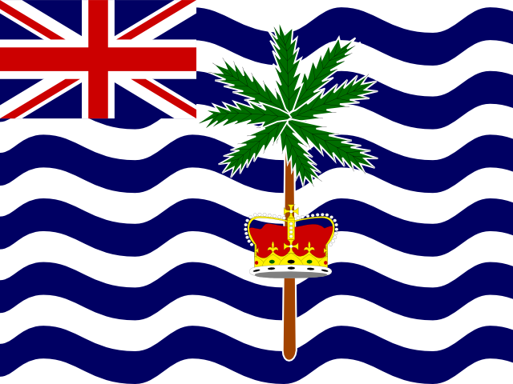|
|Iraq|IQ|Iraq|IZ|IRQ|Iraq|IRQ||
|Iran, Islamic Republic of|IR|Iran|IR|IRN|Iran|IRN||
|Iceland|IS|Iceland|IC|ISL|Iceland|ISL||
|Italy|IT|Italy|IT|ITA|Italy|ITA||
|Jamaica|JM|Jamaica|JM|JAM|Jamaica|JAM|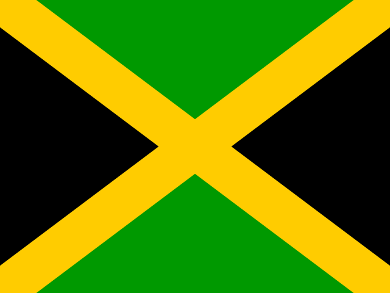|
|Jordan|JO|Jordan|JO|JOR|Jordan|JOR|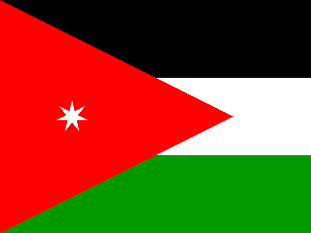|
|Japan|JP|Japan|JA|JPN|Japan|JPN||
|Kenya|KE|Kenya|KE|KEN|Kenya|KEN||
|Kyrgyzstan|KG|Kyrgyzstan|KG|KGZ|Kyrgyzstan|KGZ||
|Cambodia|KH|Cambodia|CB|KHM|Cambodia|KHM||
|Kiribati|KI|Kiribati|KR|KIR|Kiribati|KIR||
|Comoros|KM|Comoros|CN|COM|Comoros|COM||
|Korea (the Democratic People's Republic of)|KP|Democratic People's Republic of Korea|KN|PRK|Korea, North|PRK|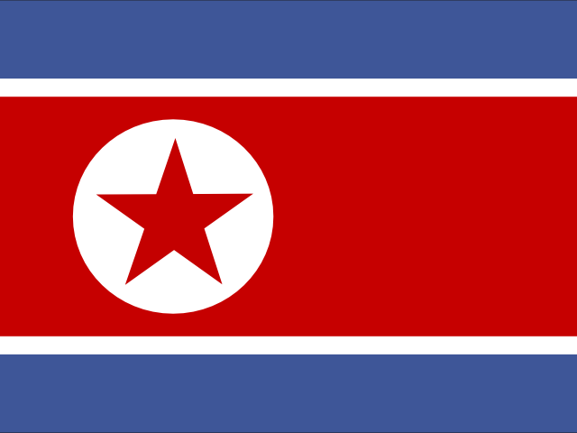|
|Korea (the Republic of)|KR|Republic of Korea|KS|KOR|Korea, South|KOR||
|Kuwait|KW|Kuwait|KU|KWT|Kuwait|KWT|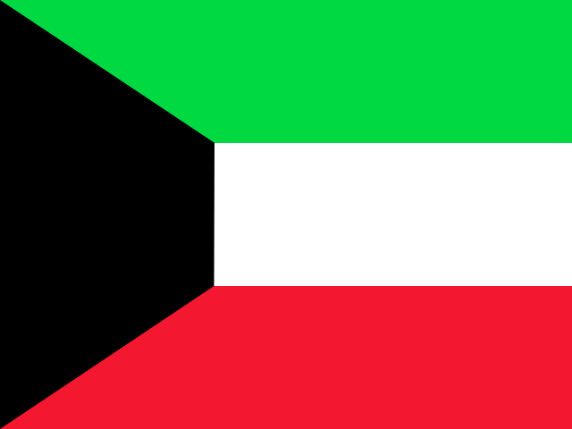|
|Cayman Islands|KY|Cayman Islands|CJ|CYM|Cayman Islands|CYM|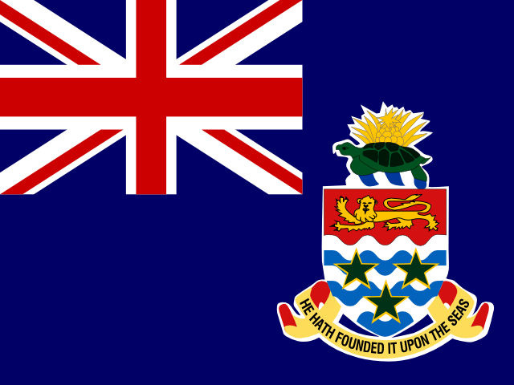|
|Kazakhstan|KZ|Kazakhstan|KZ|KAZ|Kazakhstan|KAZ||
|Lao People's Democratic Republic|LA|Laos|LA|LAO|Laos|LAO||
|Lebanon|LB|Lebanon|LE|LBN|Lebanon|LBN|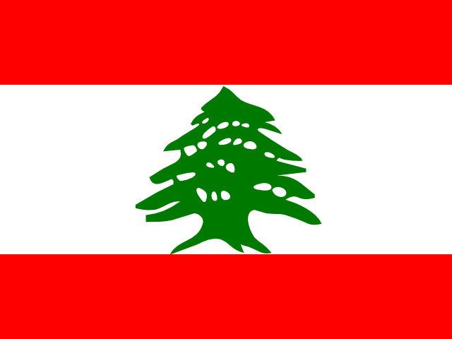|
|Saint Lucia|LC|Saint Lucia|ST|LCA|Saint Lucia|LCA|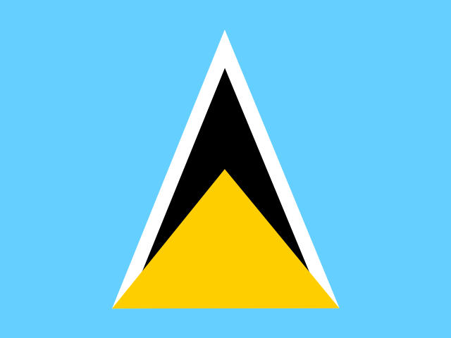|
|Liechtenstein|LI|Liechtenstein|LS|LIE|Liechtenstein|LIE|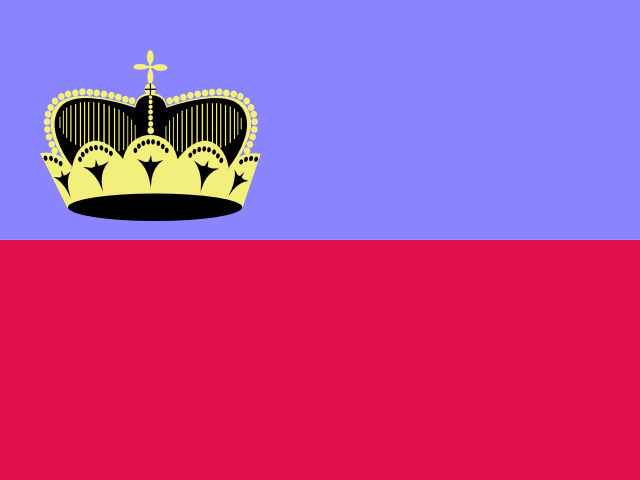|
|Sri Lanka|LK|Sri Lanka|CE|LKA|Sri Lanka|LKA||
|Liberia|LR|Liberia|LI|LBR|Liberia|LBR|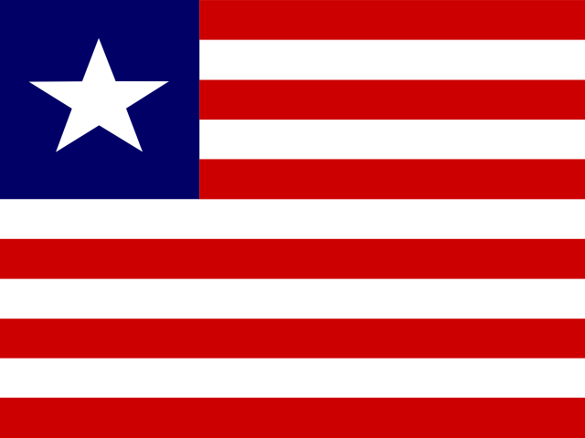|
|Lesotho|LS|Lesotho|LT|LSO|Lesotho|LSO|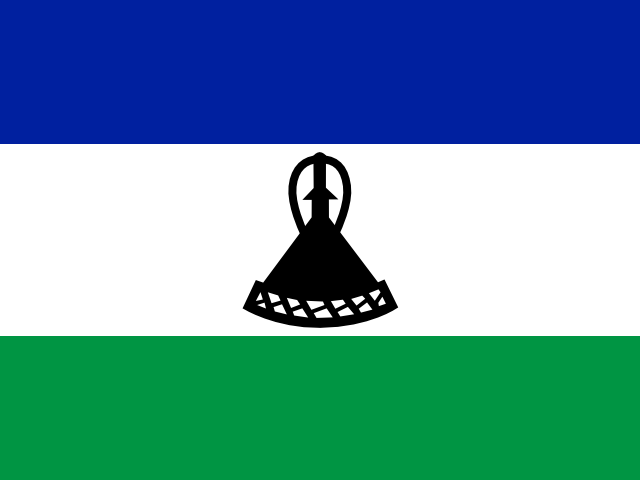|
|Lithuania|LT|Lithuania|LH|LTU|Lithuania|LTU||
|Luxembourg|LU|Luxembourg|LU|LUX|Luxembourg|LUX||
|Latvia|LV|Latvia|LG|LVA|Latvia|LVA||
|Libya|LY|Libya|LY|LBY|Libya|LBY||
|Morocco|MA|Morocco|MO|MAR|Morocco|MAR||
|Monaco|MC|Monaco|MN|MCO|Monaco|MCO|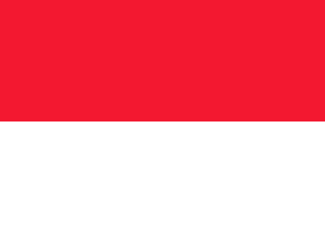|
|Moldova, Republic of|MD|Republic of Moldova|MD|MDA|Moldova|MDA||
|Montenegro|ME|Montenegro|ME|MNE|Montenegro|MNE||
|Madagascar|MG|Madagascar|MA|MDG|Madagascar|MDG||
|Marshall Islands|MH|Marshall Islands|RM|MHL|Marshall Islands|MHL||
|Macedonia, the former Yugoslav Republic of|MK|Macedonia, The Former Yugoslav Republic of|FY|FYR|Macedonia|MKD||
|Mali|ML|Mali|ML|MAL|Mali|MLI||
|Myanmar|MM|Myanmar|BM|MMR|Burma|MMR|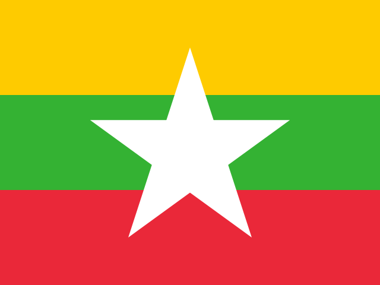|
|Mongolia|MN|Mongolia|MG|MNG|Mongolia|MNG||
|Macao|MO|Macau|MC|MAC|Macau|MAC|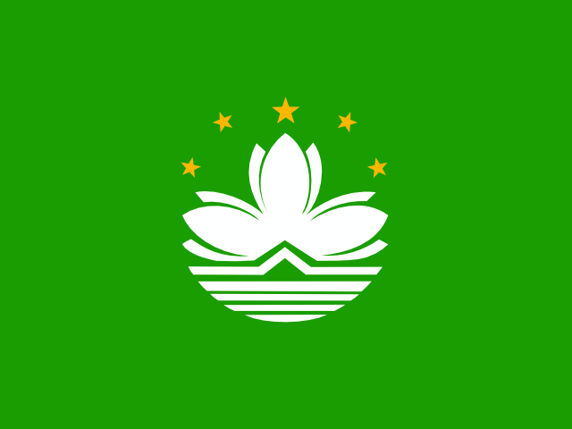|
|Northern Mariana Islands|MP|Northern Mariana Islands|CQ|MNP|Northern Mariana Islands|MNP||
|Martinique|MQ|Martinique|MB|MTQ|Martinique|MTQ|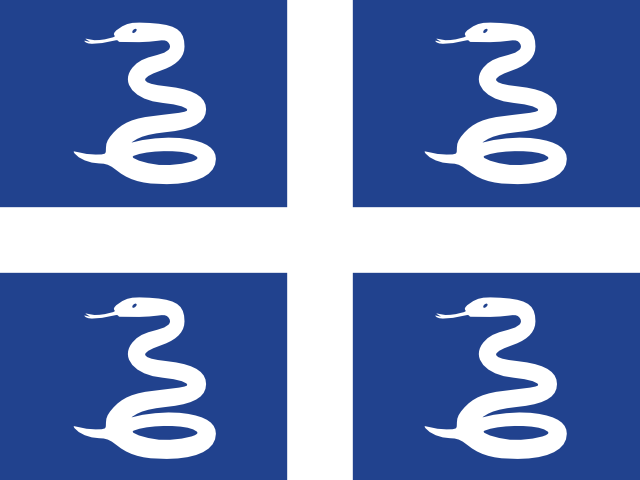|
|Mauritania|MR|Mauritania|MR|MRT|Mauritania|MRT||
|Montserrat|MS|Montserrat|MH|MSR|Montserrat|MSR|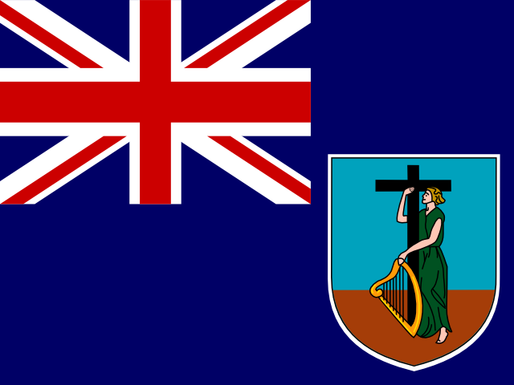|
|Malta|MT|Malta|MT|MLT|Malta|MLT|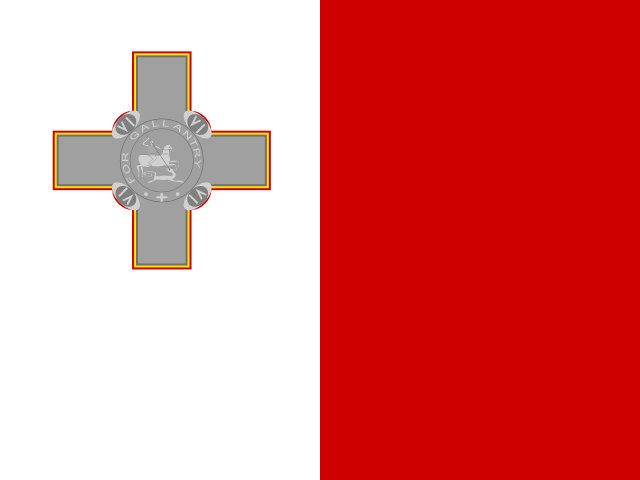|
|Mauritius|MU|Mauritius|MP|MUS|Mauritius|MUS|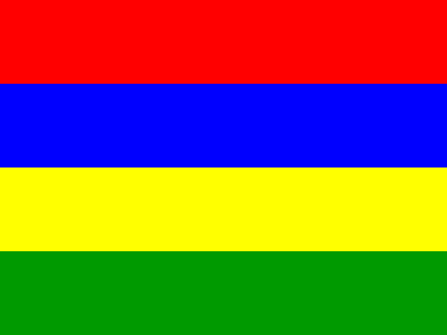|
|Maldives|MV|The Maldives|MV|MDV|Maldives|MDV||
|Malawi|MW|Malawi|MI|MWI|Malawi|MWI||
|Mexico|MX|Mexico|MX|MEX|Mexico|MEX|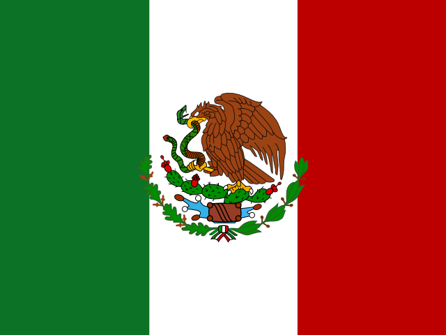|
|Malaysia|MY|Malaysia|MY|MYS|Malaysia|MYS||
|Mozambique|MZ|Mozambique|MZ|MOZ|Mozambique|MOZ|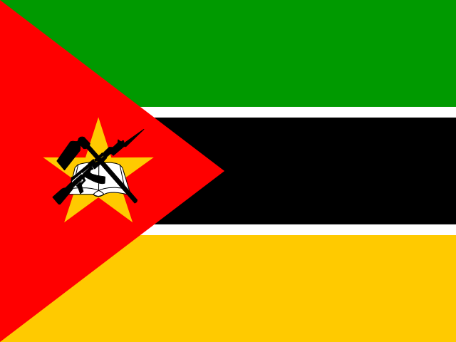|
|Namibia|NA|Namibia|WA|NAM|Namibia|NAM||
|New Caledonia|NC|New Caledonia|NC|NCL|New Caledonia|NCL|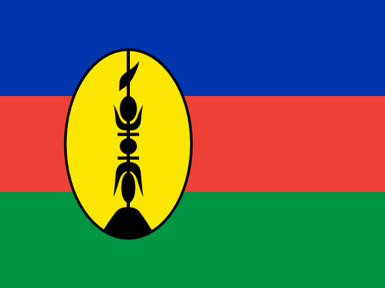|
|Niger|NE|Niger|NG|NER|Niger|NER||
|Norfolk Island|NF|Norfolk Island|NF|NFK|Norfolk Island|NFK|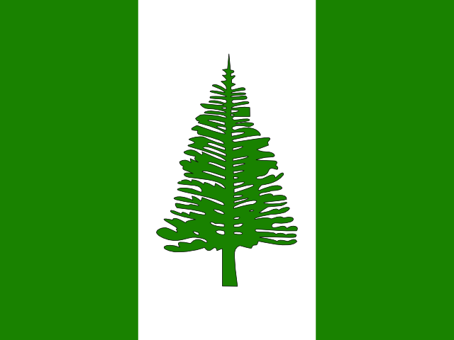|
|Nigeria|NG|Nigeria|NI|NGA|Nigeria|NGA||
|Nicaragua|NI|Nicaragua|NU|NIC|Nicaragua|NIC|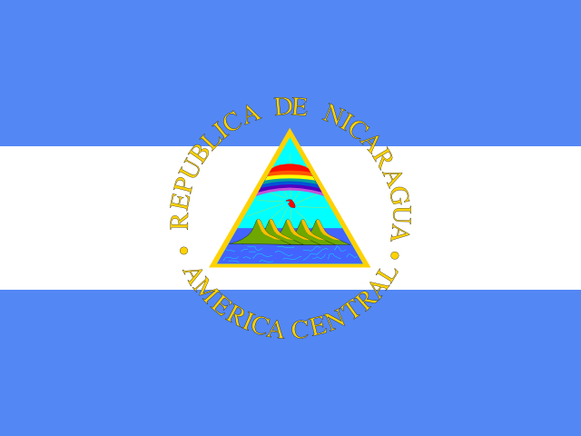|
|Netherlands|NL|Netherlands|NL|NLD|Netherlands|NLD||
|Norway|NO|Norway|NO|NOR|Norway|NOR||
|Nepal|NP|Nepal|NP|NPL|Nepal|NPL||
|Nauru|NR|Nauru|NR|NRU|Nauru|NRU||
|Niue|NU|Niue|NE|NIU|Niue|NIU|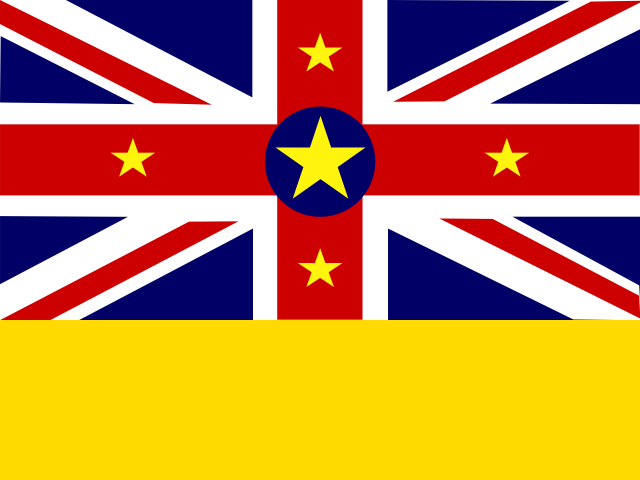|
|New Zealand|NZ|New Zealand|NZ|NZL|New Zealand|NZL||
|Oman|OM|Oman|MU|OMN|Oman|OMN|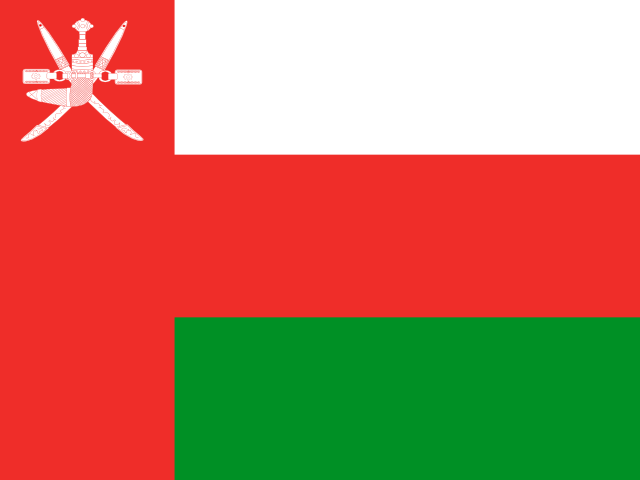|
|Panama|PA|Panama|PM|PAN|Panama|PAN|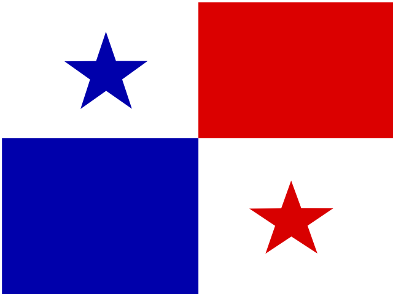|
|Peru|PE|Peru|PE|PER|Peru|PER||
|French Polynesia|PF|French Polynesia|FP|PYF|French Polynesia|PYF|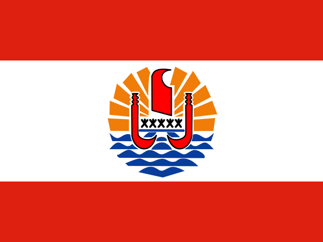|
|Papua New Guinea|PG|Papua New Guinea|PP|PNG|Papua New Guinea|PNG||
|Philippines|PH|Philippines|RP|PHL|Philippines|PHL||
|Pakistan|PK|Pakistan|PK|PAK|Pakistan|PAK||
|Poland |PL|Poland|PL|POL|Poland|POL|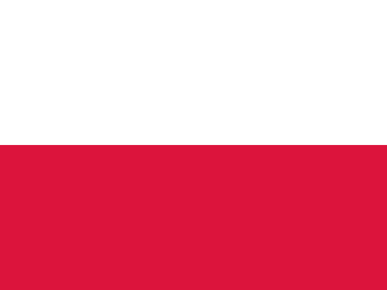|
|Saint Pierre and Miquelon|PM|Saint Pierre and Miquelon|SB|SPM|Saint Pierre and Miquelon|SPM|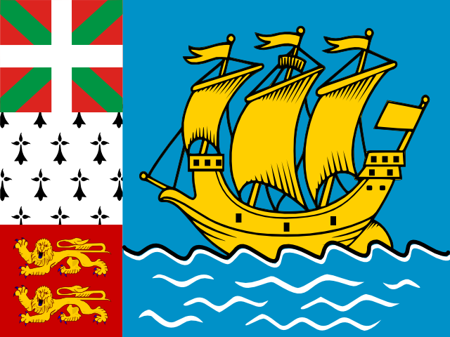|
|Pitcairn|PN|Pitcairn Islands|PN|PCN|Pitcairn Islands|PCN|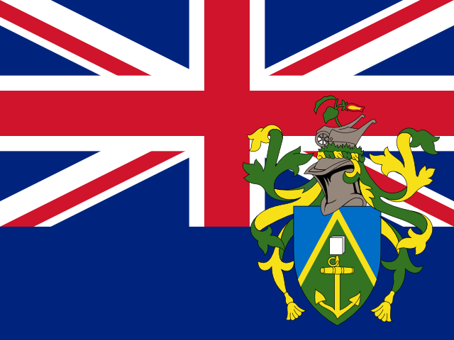|
|Puerto Rico|PR|Puerto Rico|RQ|PRI|Puerto Rico|PRI|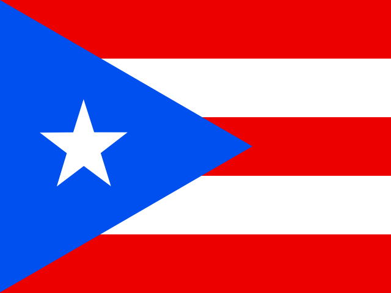|
|Palestine, State of|PS|Palestinian Territory|PS|PSE|||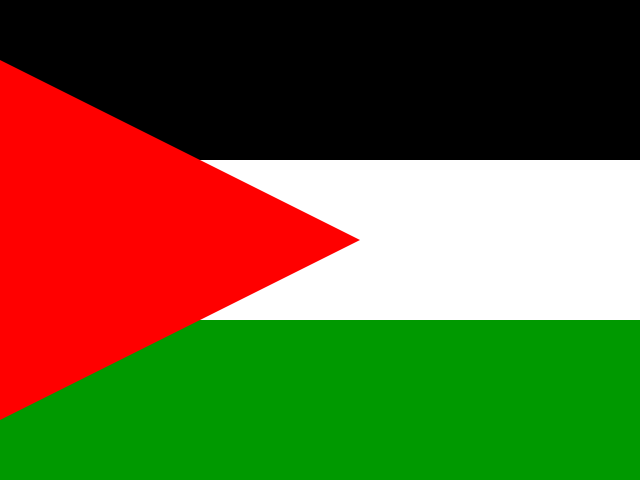|
|Portugal|PT|Portugal|PO|PRT|Portugal|PRT||
|Palau|PW|Palau|PS|PLW|Palau|PLW||
|Paraguay|PY|Paraguay|PA|PRY|Paraguay|PRY||
|Qatar|QA|Qatar|QA|QAT|Qatar|QAT|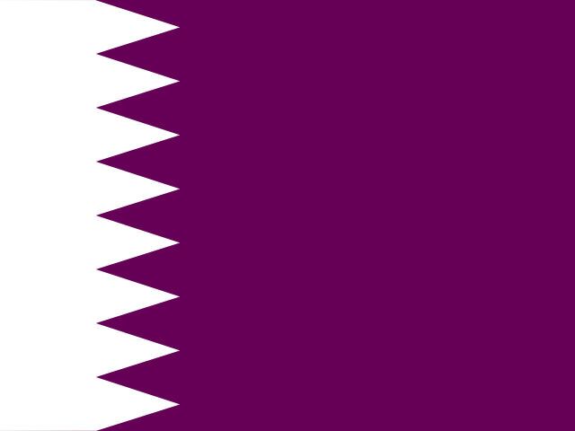|
|RÈunion     |RE|RÈunion|RE|REU|Reunion|REU||
|Romania|RO|Romania|RO|ROU|Romania|ROU||
|Serbia|RS|Serbia|RS|SRB|Serbia|SRB|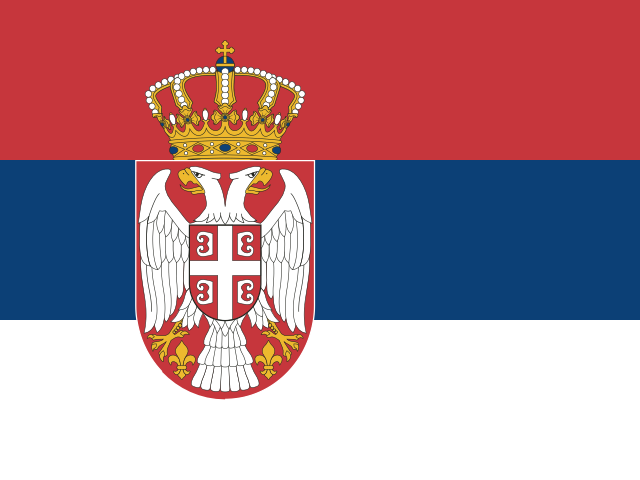|
|Russian Federation|RU|Russia|RU|RUS|Russia|RUS||
|Rwanda|RW|Rwanda|RW|RWA|Rwanda|RWA||
|Saudi Arabia|SA|Saudi Arabia|SA|SAU|Saudi Arabia|SAU|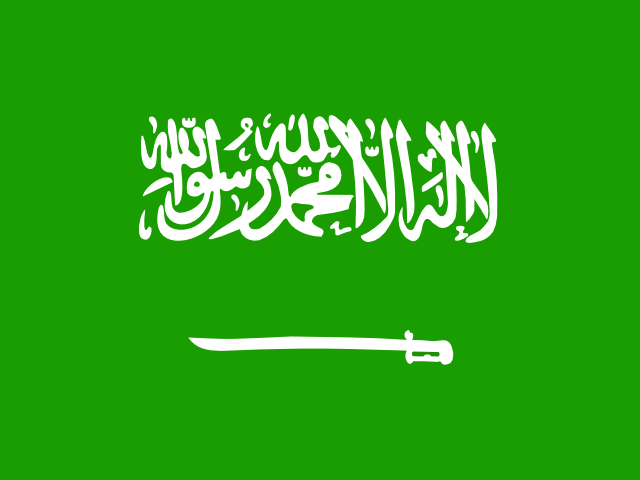|
|Solomon Islands|SB|Solomon Islands|BP|SLB|Solomon Islands|SLB|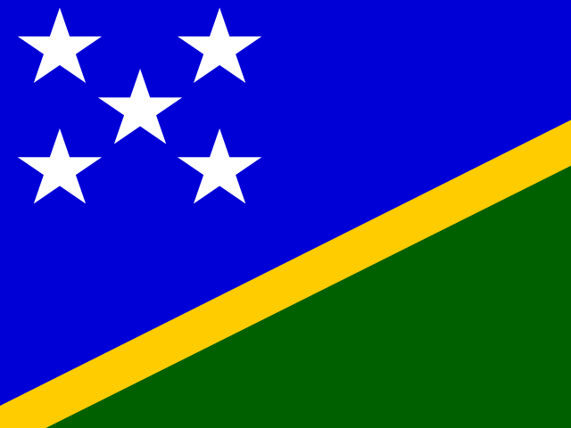|
|Seychelles|SC|Seychelles|SE|SYC|Seychelles|SYC||
|Sudan|SD|Sudan|SU|SDN|Sudan|SDN|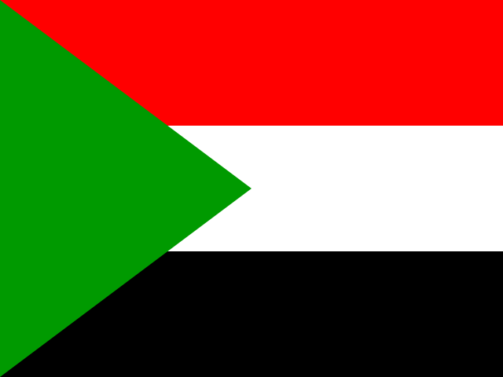|
|Sweden|SE|Sweden|SW|SWE|Sweden|SWE|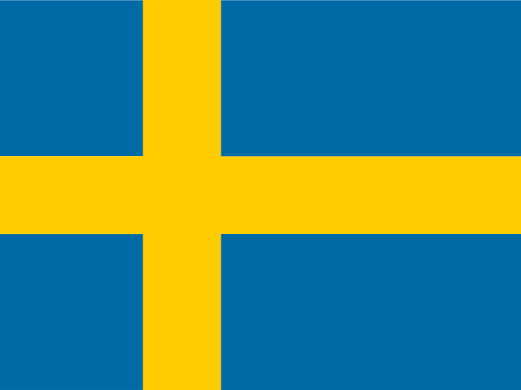|
|Singapore|SG|Singapore|SN|SGP|Singapore|SGP|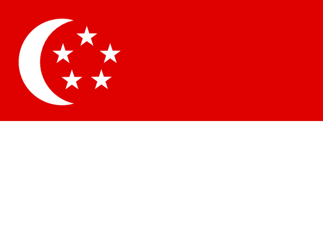|
|Saint Helena, Ascension and Tristan da Cunha|SH|Saint Helena|SH|SHN|Saint Helena, Ascension, and Tristan Da Cunha|SHN|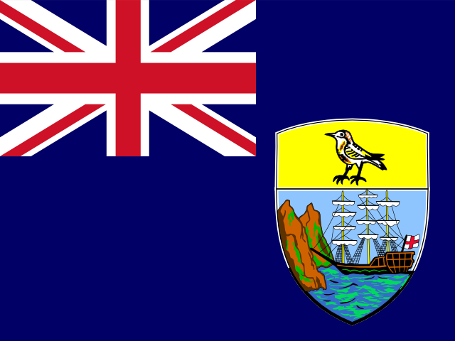|
|Slovenia        |SI|Slovenia|SI|SVN|Slovenia|SVN||
|Svalbard and Jan Mayen |SJ|Svalbard and Jan Mayen Islands|SJ|SJM|Svalbard|XSV|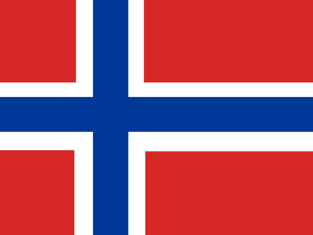|
|Slovakia|SK|Slovakia|LO|SVK|Slovakia|SVK||
|Sierra Leone|SL|Sierra Leone|SL|SLE|Sierra Leone|SLE|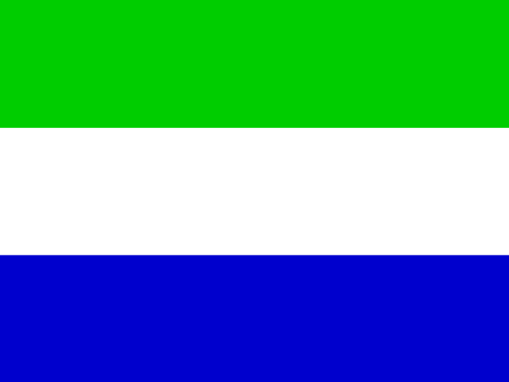|
|San Marino|SM|San Marino|SM|SMR|San Marino|SMR|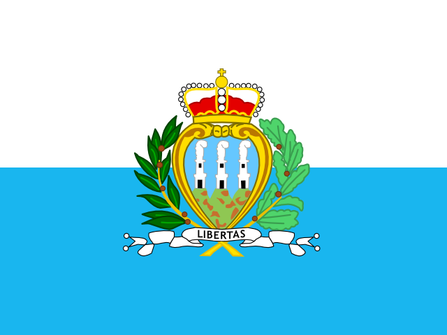|
|Senegal|SN|Senegal|SG|SEN|Senegal|SEN||
|Somalia|SO|Somalia|SO|SOM|Somalia|SOM||
|Suriname|SR|Suriname|NS|SUR|Suriname|SUR|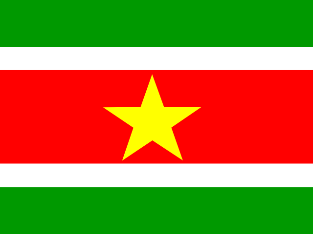|
|South Sudan|SS|South America|SR|SRR|South Sudan|SSD|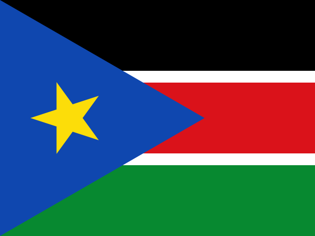|
|Sao Tome and Principe|ST|S„o TomÈ and PrÌncipe|TP|STP|Sao Tome and Principe|STP|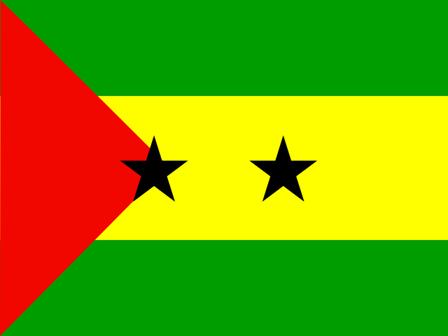|
|El Salvador |SV|El Salvador|SV|SLV|El Salvador|SLV|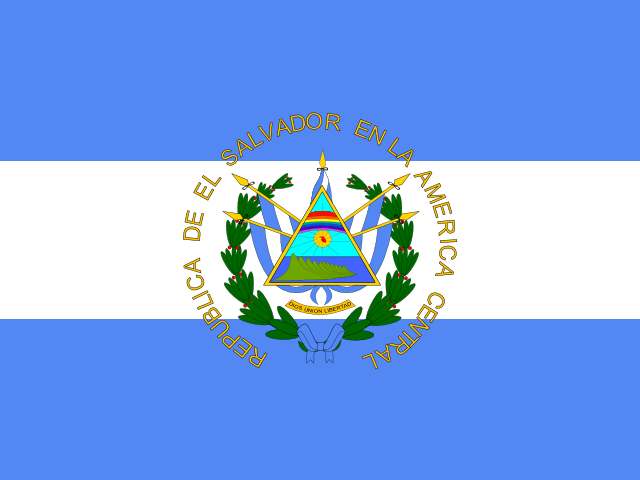|
|Syrian Arab Republic|SY|Syria|SY|SYR|Syria|SYR|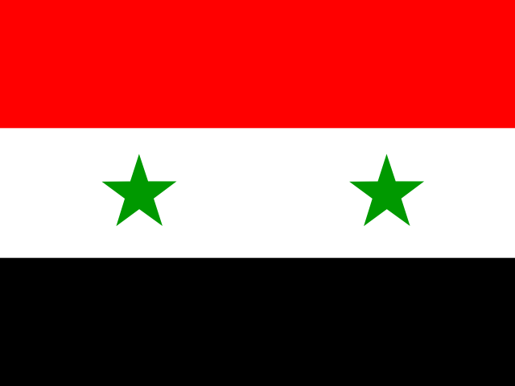|
|Swaziland|SZ|Swaziland|WZ|SWZ|Swaziland|SWZ||
|Turks and Caicos Islands|TC|Turks and Caicos Islands|TK|TCA|Turks and Caicos Islands|TCA|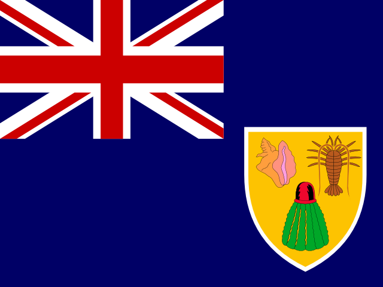|
|Chad|TD|Chad|CD|TCD|Chad|TCD|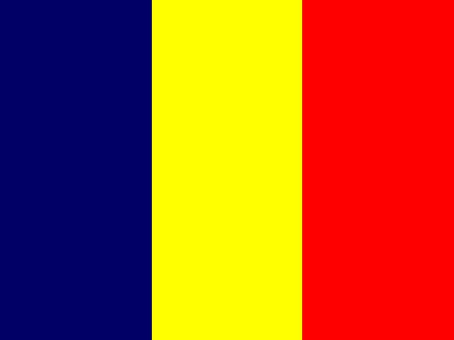|
|French Southern Territories|TF|French Southern Territories|FS|ATF|French Southern and Antarctic Lands|ATF|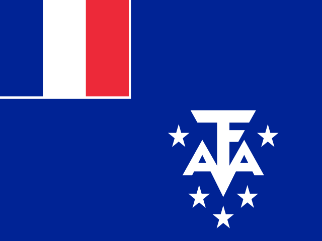|
|Togo|TG|Togo|TO|TGO|Togo|TGO||
|Thailand|TH|Thailand|TH|THA|Thailand|THA||
|Tajikistan|TJ|Tajikistan|TI|TJK|Tajikistan|TJK||
|Tokelau|TK|Tokelau|TK|TKL|Tokelau|TKL||
|Timor-Leste|TL|Timor-Leste|TL|TLS|Timor-Leste|TLS||
|Turkmenistan|TM|Turkmenistan|TX|TKM|Turkmenistan|TKM||
|Tunisia|TN|Tunisia|TS|TUN|Tunisia|TUN|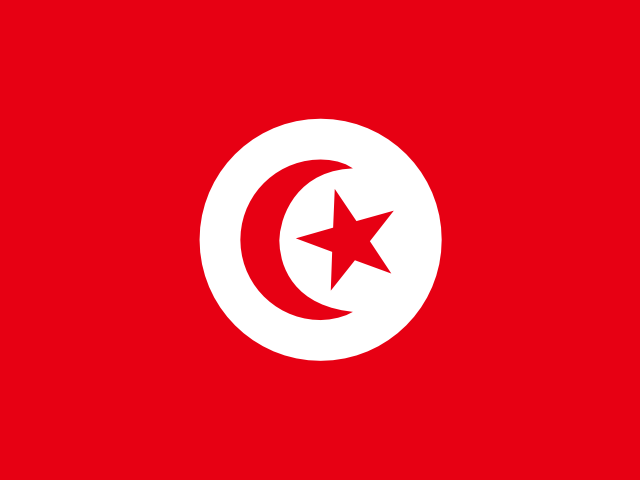|
|Tonga|TO|Tonga|TN|TON|Tonga|TON||
|Turkey|TR|Turkey|TU|TUR|Turkey|TUR||
|Trinidad and Tobago|TT|Trinidad and Tobago|TD|TTO|Trinidad and Tobago|TTO|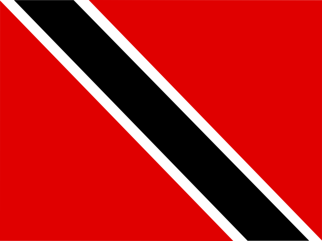|
|Tuvalu|TV|Tuvalu|TV|TUV|Tuvalu|TUV||
|Taiwan, Province of China|TW|Republic of China (Taiwan)|TW|TWN|Taiwan|TWN|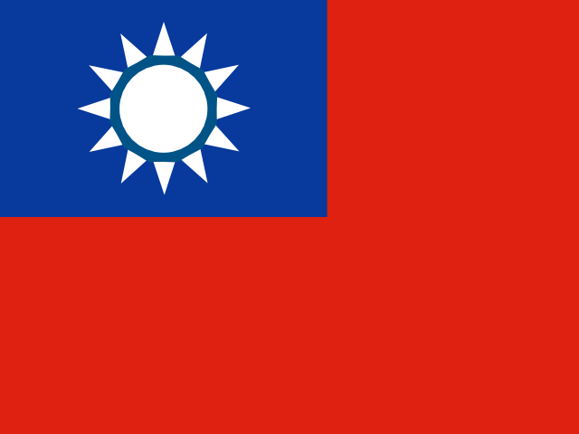|
|Tanzania, United Republic of |TZ|Tanzania|TZ|TZN|Tanzania|TZA||
|Ukraine|UA|Ukraine|UP|UKR|Ukraine|UKR|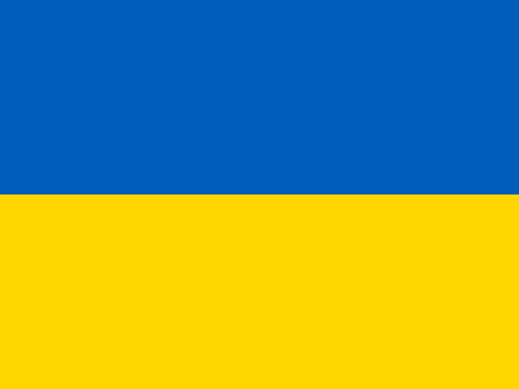|
|Uganda|UG|Uganda|UG|UGA|Uganda|UGA||
|United States Minor Outlying Islands|UM|U.S. Minor Outlying Islands|IQ|UMI||||
|United States|US|United States|US|USA|United States|USA||
|Uruguay|UY|Uruguay|UY|URY|Uruguay|URY|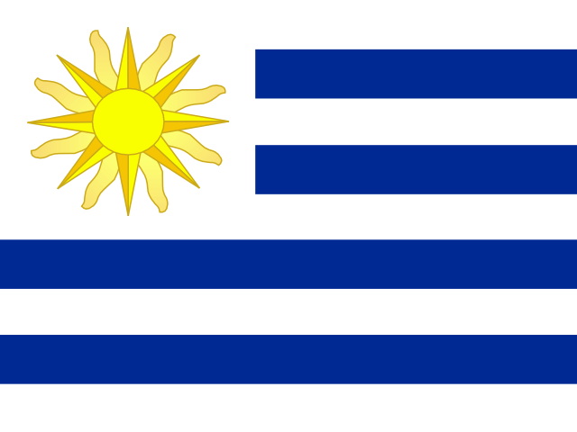|
|Uzbekistan|UZ|Uzbekistan|UZ|UZB|Uzbekistan|UZB||
|Holy See (Vatican City State)|VA|Vatican City (Holy See)|VT|VAT|Vatican City|VAT||
|Saint Vincent and the Grenadines|VC|Saint Vincent and the Grenadines|VC|VCT|Saint Vincent and The Grenadines|VCT|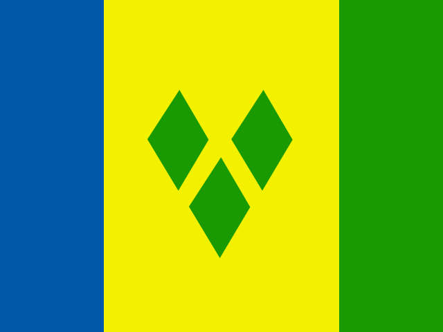|
|Venezuela, Bolivarian Republic of|VE|Venezuela|VE|VEN|Venezuela|VEN|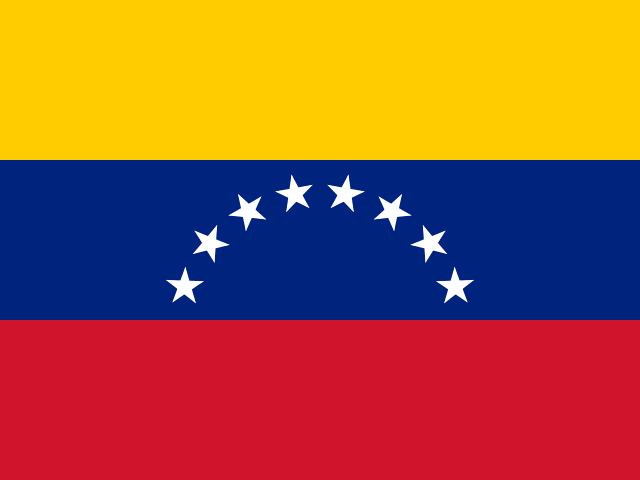|
|Virgin Islands, British|VG|British Virgin Islands|VS|VGB|Virgin Islands, British|VGB|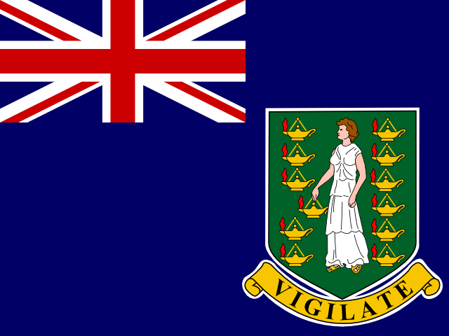|
|Virgin Islands, U.S.|VI|U.S. Virgin Islands|VI|VIR|Virgin Islands, U.S.|VIR|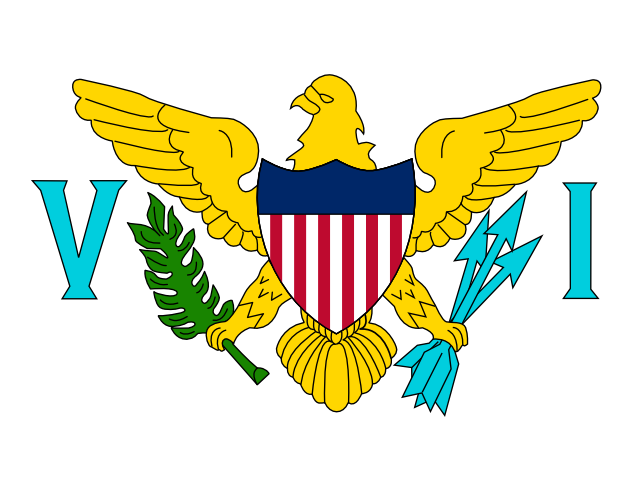|
|Viet Nam|VN|Vietnam|VM|VNM|Vietnam|VNM||
|Vanuatu|VU|Vanuatu|NH|VUT|Vanuatu|VUT||
|Wallis and Futuna|WF|Wallis and Futuna Islands|WF|WLF|Wallis and Futuna|WLF|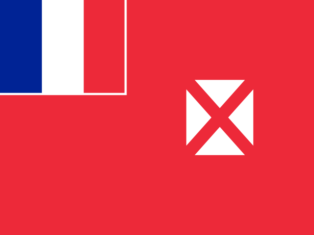|
|Samoa|WS|Samoa|SS|WSM|Samoa|WSM||
|Yemen|YE|Yemen|YE|YEM|Yemen|YEM|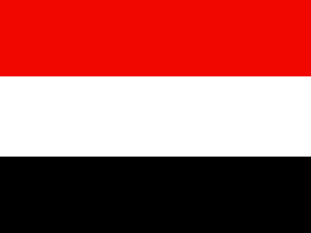|
|South Africa |ZA|South Africa|SF|ZAF|South Africa|ZAF||
|Zambia|ZM|Zambia|ZA|ZMB|Zambia|ZMB|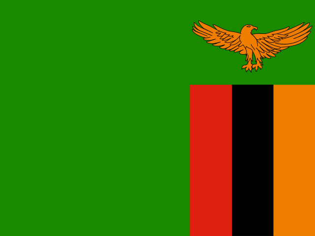|
|Zimbabwe|ZW|Zimbabwe|ZI|ZWE|Zimbabwe|ZWE||
|||Ashmore and Cartier Islands|AT|ACI|||
|||Coral Sea Islands|CR|CSI|||
|||Europe|EE|EEE|||
|||Howland Island|HQ|HQI|||
|||Jan Mayen Island|JN|JNM|||
|||Johnston Atoll|JQ|JQA|||
|||Netherlands Antilles|NA|ANT|||
|||NATO countries|NT|NTT|||
|||Paracel Islands|PF|PFI|||
|||Saint Kitts and Nevis|SC|KNA|Saint Kitts and Nevis|KNA|
|||Oceania|UU|UUU|||
